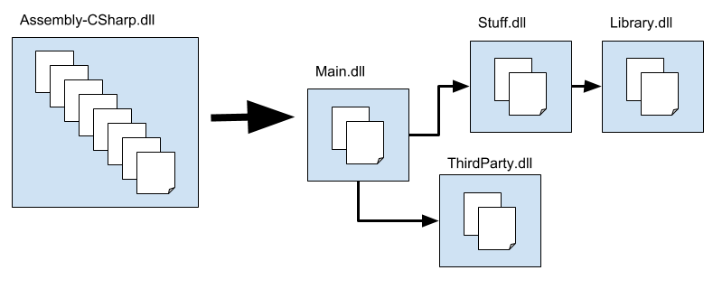

# Unity Attack : 3. 엔진의 구조

https://github.com/synod2/Unity_Attack

Unity 구조분석 1과 2에서 치트엔진을 가지고 많은 삽질을 했었다. 

최종적으로 알아낸 건 **Object → Health 컴포넌트 → 체력 값** 순의 구조를 가지고 있다는 것.

엔진의 구조부터 차근차근 분석하여 실제로는 어떻게 되어있는지와 그 값을 다루는 방법을 익혀보자. 

### Assembly-Csharp.dll

Unity 엔진에서는 두가지 어셈블리를 가지고 있다.

1. Assembly-Csharp : 게임 내 에셋들에 들어있는 모든 스크립트를 묶어둠
2. Assembly-Csharp-Editor : Editor 폴더 안에 들어있는 스크립트를 묶어둠. 



위 그림에서는 여러 DLL 파일들이 Assembly-Cshaep.dll 이라는 파일 하나에 묶여있는것이 보인다. 파일 하나에서 종속성이 명확하게 정의된 여러 어셈블리 파일들로 분리되어 있는 셈인데, 이는 특정 스크립트의 변경 사항을 적용할 때 필요한 어셈블리만 다시 빌드되도록 하기 위함이라고 한다. 

이렇게 하면 코드 수정 후 다시 빌드시 해당 어셈블리만 빌드되기 때문에 빌드 시간을 많이 단축시킬 수 있다. 

개발자들이 작성한 코드가 이곳에 들어간다고 보면 된다. 


위와같이 Asset 폴더에는 개발자들이 작성한 코드들이 존재하고, 


게임폴더 → data → managed 폴더에는 Assembly-Csharp.dll 파일이 존재한다. 


apk의 경우는 assets → bin → data → managed 에 dll 파일이 존재한다.

---

### Decompile

dnSpy를 이용하여 assembly-Csharp.dll 분석을 시도해보자. 


dnspy에서 dll파일을 불러오면 위와 같이 PE구조, 코드 내에서 정의된 자료형(클래스), 사용된 모듈, 작성 코드등을 자동으로 분류 해준다. 


Type Reference에 분류된 항목들을 보면, 게임 내에서 사용되는 클래스의 정의와 그 하위 속성/메소드들에 대해 정의된 항목들을 모두 볼 수 있게 해준다. 


{} 기호가 있는 하위항목엔 코드 내에 정의된 함수 목록을 볼 수 있다. 


함수 선택시에 소스코드까지 다 볼 수 있고, 해당 코드가 dll파일의 어떤 오프셋에 위치해 있는지, 코드 오프셋까지 알 수 있다. 

적 터렛의 정보를 확인해보면 

```csharp
public class EnemyTurret : MonoBehaviour
{
	// Token: 0x17000013 RID: 19
	// (get) Token: 0x06000070 RID: 112 RVA: 0x00003E1B File Offset: 0x0000201B
	// (set) Token: 0x06000071 RID: 113 RVA: 0x00003E23 File Offset: 0x00002023
	public EnemyTurret.AIState aiState { get; private set; }

	// Token: 0x06000072 RID: 114 RVA: 0x00003E2C File Offset: 0x0000202C
	private void Start()
	{
		this.m_Health = base.GetComponent<Health>();
		DebugUtility.HandleErrorIfNullGetComponent<Health, EnemyTurret>(this.m_Health, this, base.gameObject);
		Health health = this.m_Health;
		health.onDamaged = (UnityAction<float, GameObject>)Delegate.Combine(health.onDamaged, new UnityAction<float, GameObject>(this.OnDamaged));
		this.m_EnemyController = base.GetComponent<EnemyController>();
		DebugUtility.HandleErrorIfNullGetComponent<EnemyController, EnemyTurret>(this.m_EnemyController, this, base.gameObject);
		EnemyController enemyController = this.m_EnemyController;
		enemyController.onDetectedTarget = (UnityAction)Delegate.Combine(enemyController.onDetectedTarget, new UnityAction(this.OnDetectedTarget));
		EnemyController enemyController2 = this.m_EnemyController;
		enemyController2.onLostTarget = (UnityAction)Delegate.Combine(enemyController2.onLostTarget, new UnityAction(this.OnLostTarget));
		this.m_RotationWeaponForwardToPivot = Quaternion.Inverse(this.m_EnemyController.GetCurrentWeapon().weaponMuzzle.rotation) * this.turretPivot.rotation;
		this.aiState = EnemyTurret.AIState.Idle;
		this.m_TimeStartedDetection = float.NegativeInfinity;
		this.m_PreviousPivotAimingRotation = this.turretPivot.rotation;
	}
```

위와같은 형태로 클래스가 선언되어있다. 

**EnemyTurret** 클래스의 **m_health** 변수에 **Health** 클래스를 ****가져와 컴포넌트 형태로 저장하고, Health 클래스를 자료형으로 하는 health 변수를 선언하여 아까 가져온 컴포넌트 클래스를 사용하는 식으로 코드가 작성되어있다. 

```csharp
⁝
	// Token: 0x06000090 RID: 144 RVA: 0x000045B4 File Offset: 0x000027B4
	public void TakeDamage(float damage, GameObject damageSource)
	{
		if (this.invincible)
		{
			return;
		}
		float currentHealth = this.currentHealth;
		this.currentHealth -= damage;
		this.currentHealth = Mathf.Clamp(this.currentHealth, 0f, this.maxHealth);
		float num = currentHealth - this.currentHealth;
		if (num > 0f && this.onDamaged != null)
		{
			this.onDamaged(num, damageSource);
		}
		this.HandleDeath();
	}
⁝
```

health 클래스의 코드. 체력에 관한 동작을 처리하는 함수들이 함께 선언되어있다.

TakeDamage() 함수를 보면, 오브젝트의 invincible 변수값이 세팅되어 있을경우 피해를 받지 않고, 그 외의 경우는 체력에서 Damage를 빼는 연산을 진행해 오브젝트의 currentHealth 값을 감소시키는 것을 볼 수 있다.  이후 HandleDeath() 함수를 호출하여 m_IsDead 변수가 세팅되어 있을경우 이미 사망한 오브젝트이니 별다른 동작을 진행하지 않고, 오브젝트의 체력이 0보다 낮으면서 onDie 값이 null이 아니면 오브젝트의 m_IsDead 변수를 세팅하고 onDie() 함수를 실행한다. (크게 의미있는 부분은 아닌듯.)

---

### 번외. UnityAction과 Delegate 개념

UnityAction 객체는 C#의 Delegate 개념으로 사용되는데, C#에서 Delegate 객체는 메소드를 참조할 때 대신 선언하여 사용할 수 있는 대리자 역할을 한다. 

```csharp
delegate 반환형 델리게이트명(매개변수..);
```

위와 같은 형태로 Delegate 객체를 선언하면,  생성된 메소드를 선언하여 사용할 때 delegate 객체와 연결하여 대신 사용할 수 있게끔 한다. 

```csharp
namespace ConsoleApplication39
{
    delegate int PDelegate(int a, int b);

    class Program
    {
        static int Plus(int a, int b)
        {
            return a + b;
        }

        static void Main(string[] args)
        {
            PDelegate pd1 = Plus;
            PDelegate pd2 = delegate(int a, int b)
            {
                return a / b;
            };

            Console.WriteLine(pd1(5, 10));
            Console.WriteLine(pd2(10, 5));
        }
    }
}
```

위와같이 Plus 메소드를 생성하고, pd1이라는 이름으로 PDelegate와 연결하여 별개의 클래스를 선언하지 않고 사용할 수 있게 한다. 

```csharp
namespace UnityEngine.Events
{
	public delegate void UnityAction();
	public delegate void UnityAction<T0>(T0 arg0);
	public delegate void UnityAction<T0, T1>(T0 arg0, T1 arg1);
	public delegate void UnityAction<T0, T1, T2>(T0 arg0, T1 arg1, T2 arg2);
	public delegate void UnityAction<T0, T1, T2, T3>(T0 arg0, T1 arg1, T2 arg2, T3 arg3);
}
```

unityAction 객체는 위와 같이 사전에 정의되어 사용하는 Delegate 객체이다. 4개의 인자까지 커버가 가능하다. 

---

정리하면, EnemyTurret 클래스의 체력값은 **EnemyTurret** → **health** → **m_health** → **Health → currentHealth** 의 형태로 저장되어 사용되고 있다.  이는 Player에도 동일하게 적용되는 사항. 

그리고 **Health** 클래스를 컴포넌트로 사용하고 있기 때문에 체력 회복, 피격, 사망등의 이벤트에도 동일한 코드를 적용하여 사용중임을 알 수 있다. 즉, 체력 증가/감소 이벤트에 대해 코드패치를 진행하면 적과 플레이어 모두 동일하게 적용받을 것이라는 이야기. 

따라서 플레이어나 적의 메모리 영역을 찾아 값을 고정하거나, 적과 플레이어에게 다르게 적용되는 코드를 찾아 코드 패치를 진행해야 될듯 하다. 

---

### 유니티 디렉토리 구조

```csharp
│   *.exe
└───*_Data
    │   globalgamemanagers
    │   globalgamemanagers.assets
    │   level0
    │   level0.resS
        ...
    |   levelN
    |   levelN.resS
    │   sharedassets0.assets
    │   sharedassets0.assets.resS
        ...
    |   sharedassetsN.assets
    |   sharedassetsN.assets.resS
    |   resources.assets
    ├───Managed
    │       Assembly-CSharp.dll
    │       Assembly-UnityScript.dll
    │       Mono.Security.dll
    │       mscorlib.dll
    │       System.Core.dll
    │       System.dll
    │       UnityEngine.dll
    │       UnityEngine.dll.mdb
    │       UnityEngine.Networking.dll
    │       UnityEngine.UI.dll
    ├───Mono
    │   │   mono.dll
    │   └───etc
    │       └───mono
    │           │   browscap.ini
    │           │   config
    │           ├───1.0
    │           │       DefaultWsdlHelpGenerator.aspx
    │           │       machine.config
    │           ├───2.0
    │           │   │   DefaultWsdlHelpGenerator.aspx
    │           │   │   machine.config
    │           │   │   settings.map
    │           │   │   web.config
    │           │   └───Browsers
    │           │           Compat.browser
    │           └───mconfig
    │                   config.xml
    └───Resources
            unity default resources
            unity_builtin_extra
```

[유니티 디렉토리 구조](https://www.notion.so/c02adc0aaf824d3d9fd8424e8fe31c5a)

.asset과 .resS 파일은 전용 도구를 이용하여 에셋들을 추출해 낼 수 있다. 

---

### 참고문서

[https://blog.hexabrain.net/151](https://blog.hexabrain.net/151) - C#의 Delegate 개념 

[http://rapapa.net/?p=2936](http://rapapa.net/?p=2936) - unityAction