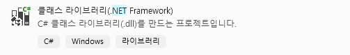

# Unity Attack : 4. DLL injection

https://github.com/synod2/Unity_Attack

### Code(Script) Injection in C#

 C#으로 만들어진 유니티 엔진에 코드 패치를 진행할 때는 이전 assault cube 때 처럼 직접 DLL인젝션을 진행해도 되지만, C#으로 공격 스크립트를 작성하여 사용한다면 유니티에서 사용하는 문법과 클래스 등을 그대로 쓸 수 있다.  

즉, C#으로 DLL 인젝션 도구를 만들어 사용하면 훨씬 편리하다는 뜻이다. 지금의 경우는 직접 만드는 대신에 도구를 사용해보려고 한다. 

[https://github.com/warbler/SharpMonoInjector](https://github.com/warbler/SharpMonoInjector) - **sharp mono Injector**

[https://github.com/Broihon/GH-Injector-GUI](https://github.com/Broihon/GH-Injector-GUI) - **Guided Hacking DLL Injector**

기존에 내가 CPP로 작성했던 DLL Injection 도구는 아래와 같다. 

```cpp
module = GetModuleHandle(L"kernel32.dll");
thread_start_routine = (LPTHREAD_START_ROUTINE)GetProcAddress(module, "LoadLibraryW");
thread_handle = CreateRemoteThread(
	process_handle,
	nullptr,
	0,
	thread_start_routine,
	remote_buffer,
	0,
	nullptr
);
```

 module 함수로 현재 프로세스에서 사용중인 **Kernel32.dll** 의 모듈 핸들을 가져와 **GetProcAddress** 함수를 통해 Kernel32.dll 모듈 내의 **LoadLibraryW** 함수의 포인터를 찾고, **CreateRemoteThread** 함수를 실행하여 현재 프로세스의 새로운 쓰레드를 생성하는데, 이때 **LoadLibraryW** 함수를 실행되어 remote_buffer 변수에 들어있는 내가 지정한 경로에 존재하는 dll이 로드된다. dll이 로드되면 dllmain 함수가 실행되어 작성해놓은 동작들이 실행되는 방식이다. 

sharp mono Injector에서 DLL Injection을 진행하는 방식은 다음과 같다. 

1. **program.cs::inject()** 함수에서 DLL파일의 경로와 **classname, methodname** 등을 가져와 **injector.cs::inject()**로 넘겨준다. 

```cpp
⁝
//program.cs::inject()
using (injector) {
                IntPtr remoteAssembly = IntPtr.Zero;

                try {
                    remoteAssembly = injector.Inject(assembly, @namespace, className, methodName);
                } catch (InjectorException ie) {
                    System.Console.WriteLine("Failed to inject assembly: " + ie);
                } catch (Exception exc) {
                    System.Console.WriteLine("Failed to inject assembly (unknown error): " + exc);
                }
⁝
```

2. **injector.cs::inject()**에서 메모리를 할당하고 **injector.cs::RuntimeInvoke()** 함수에 method 정보를 넘긴다. 

```cpp
⁝
//Injector.cs::Inject()
public IntPtr Inject(byte[] rawAssembly, string @namespace, string className, string methodName)
        {
            if (rawAssembly == null)
                throw new ArgumentNullException(nameof(rawAssembly));

            if (rawAssembly.Length == 0)
                throw new ArgumentException($"{nameof(rawAssembly)} cannot be empty", nameof(rawAssembly));

            if (className == null)
                throw new ArgumentNullException(nameof(className));

            if (methodName == null)
                throw new ArgumentNullException(nameof(methodName));

            IntPtr rawImage, assembly, image, @class, method;

            ObtainMonoExports();
            _rootDomain = GetRootDomain();
            rawImage = OpenImageFromData(rawAssembly);
            _attach = true;
            assembly = OpenAssemblyFromImage(rawImage);
            image = GetImageFromAssembly(assembly);
            @class = GetClassFromName(image, @namespace, className);
            method = GetMethodFromName(@class, methodName);
            RuntimeInvoke(method);
            return assembly;
        }
⁝
```

3. **injector::RuntimeInvoke()** 에서 **injector::Execute()** 함수로 할당한 이전에 메모리 포인터와 method를 넘긴다. 

```cpp
⁝
//injector::RuntimeInvoke() 
private void RuntimeInvoke(IntPtr method)
        {
            IntPtr excPtr = Is64Bit ? _memory.AllocateAndWrite((long)0) : _memory.AllocateAndWrite(0);

            IntPtr result = Execute(Exports[mono_runtime_invoke],
                method, IntPtr.Zero, IntPtr.Zero, excPtr);

            IntPtr exc = (IntPtr)_memory.ReadInt(excPtr);

            if (exc != IntPtr.Zero) {
                string className = GetClassName(exc);
                string message = ReadMonoString((IntPtr)_memory.ReadInt(exc + (Is64Bit ? 0x20 : 0x10)));
                throw new InjectorException($"The managed method threw an exception: ({className}) {message}");
            }
        }
⁝
```

4. **injector.Execute()**에서 **AllocateAndWrite()** 함수를 이용해 작성한 코드를 메모리에 할당 후 쓰기 작업을 진행한 다음, **CreateRemoteThread()** 함수에 프로세스의 핸들과 할당한 메모리 영역의 포인터를 넘겨 현재 프로세스의 새로운 쓰레드를 생성하고 작성한 코드를 메모리에 올린다. 

```cpp
⁝
//injector::Execute() 
private IntPtr Execute(IntPtr address, params IntPtr[] args)
        {
            IntPtr retValPtr = Is64Bit
                ? _memory.AllocateAndWrite((long)0)
                : _memory.AllocateAndWrite(0);

            byte[] code = Assemble(address, retValPtr, args);
            IntPtr alloc = _memory.AllocateAndWrite(code);

            IntPtr thread = Native.CreateRemoteThread(
                _handle, IntPtr.Zero, 0, alloc, IntPtr.Zero, 0, out _);
⁝
```

이렇게 메모리에 올라간 코드는 이전 CPP dll injection과 동일하게 실행 될 텐데, sharp injector의 경우는 method를 지정해서 실행할 것이기 때문에 해당 메소드의 내용만 실행될 것이다. 

---

### VS에서 DLL 프로젝트 생성



visual studio에서 .NET 프레임워크 클래스 라이브러리 프로젝트를 생성한다. 


이후 기본값으로 설정된 Class1.cs 파일의 이름을 Loader.cs 로 변경해주고 Loader.cs의 내용을 작성해준다.

```csharp
//Loader.cs
namespace unity_injection_1
{
    public class Loader
    {
        static UnityEngine.GameObject gameObject;

        public static void Load()
        {
            gameObject = new UnityEngine.GameObject();
            gameObject.AddComponent<Cheat>();
            UnityEngine.Object.DontDestroyOnLoad(gameObject);
        }

        public static void Unload()
        {
            UnityEngine.Object.Destroy(gameObject);
        }
    }
}
```

**Loader.cs** 은 유니티 엔진의 클래스와 메소드를 가져와 사용할 수 있게 준비해주는 역할을 한다.  여기서 **gameObject.AddComponent** 함수가 같은 프로젝트 내의 **Cheat.cs** 파일을 가져와 게임상에 존재하는 컴포넌트처럼 쓸 수 있게 만든다. 

```csharp
//Cheat.cs
namespace unity_injection_1
{
    public class Cheat : UnityEngine.MonoBehaviour
    {
        private void OnGUI()
        {
            UnityEngine.GUI.Label(new UnityEngine.Rect(10, 10, 200, 40), "Hello Unity World!");
        }
    }
}
```

Cheat.cs 파일을 작성했다. 성공적으로 DLL이 로드되면 유니티 엔진 기능을 이용해 "Hello Unity World!" 라는 글자를 화면에 출력하는 동작을 수행한다. 


UnityEngine.dll 을 불러오기 위해 솔루션 탐색기 - 참조에 우클릭 - 찾아보기 - <유니티 설치경로>\Editor\Data\Managed 로 이동하여 UnityEngine.dll 과 UnityEditor.dll을 추가해주자. 


혹은, 프로젝트 속성 - 참조경로 에서 \Editor\Data\Managed 경로를 추가해줘도 된다. 

그 다음, 프로젝트 폴더의 <프로젝트 이름>.csproj 파일을 열어 Deterministic 속성을 tue에서 False로 변경해주자. 


```csharp
<Deterministic>false</Deterministic>
```

그리고 프로젝트를 다시 열어 컴파일하면 제대로 진행된다. 생성된 dll 파일을 인젝션해보자. 

---

### DLL Injection


혹은 GUI가 아닌 CLI버전 도구를 사용할 수 있다. 


인젝션 도구에서 dll파일 경로와 클래스,메소드 이름을 지정하여 Inject하면 status에 Injection successful (혹은 인젝션된 DLL의 메모리 주소) 이라는 문구가 보이고, 


게임 화면에 "This is very useful cheat" 라는 문구가 출력된게 보인다. 아까 코드에 작성했던 텍스트 출력 함수가 제대로 동작한 것. 

이제 게임 내에 존재하는 오브젝트들의 정보를 받아오고, 그 정보를 조작하는 시도를 진행해보자. 

---

### 참고 문서

[https://github.com/warbler/SharpMonoInjector](https://github.com/warbler/SharpMonoInjector) - Sharp Mono Injector 

[https://www.unknowncheats.me/wiki/A_Beginner's_Guide_To_Hacking_Unity_Games](https://www.unknowncheats.me/wiki/A_Beginner%27s_Guide_To_Hacking_Unity_Games#Files) 

[https://guidedhacking.com/threads/how-to-hack-unity-games-using-mono-injection-tutorial.11674/](https://guidedhacking.com/threads/how-to-hack-unity-games-using-mono-injection-tutorial.11674/)