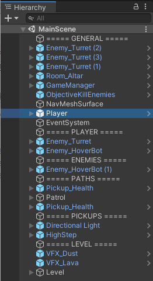

# Unity Attack : 5. DLL Injection 2

### GameObject 가져오기

먼저 원본 게임의 Scene에는 다음과 같은 오브젝트들이 존재한다. 



여기서 정보를 받아오고자 하는 컴포넌트는 Enemy_Turret과 Player인데, Assembly-Cshaep.dll 파일에서 Scene에 대한 정보를 받아오지는 못하므로, 인젝션한 코드를 가지고 저 목록을 받아와 보자. 

```csharp
namespace unity_injection_2
{
    public class Cheat : UnityEngine.MonoBehaviour
    {
        private void OnGUI()
        {
            GameObject[] allObjects = UnityEngine.Object.FindObjectsOfType<GameObject>();
            int i = 0;
            foreach (GameObject objs in allObjects)
            {
                if (objs.activeInHierarchy)
                {
                    UnityEngine.GUI.Label(new UnityEngine.Rect(20, 50 + i, 200, 40), objs.name);
                    i += 20;
                }
            }
        }
    }
}
```


Hierarchy에 존재하는 모든 GameObject들을 받아와 출력하게 하니 저런 상황이 되었다. 현재 씬에 존재하는 모든 하위 게임오브젝트들까지 다 가져와서 발생하는 문제로 보인다.  그냥 게임 리소스만 가지고 이름을 알아낼 방법은 없나? 

유니티 인게임에서 디버깅용 콘솔을 띄우는 모듈을 찾았다. 해당 모듈을 DLL안에 추가하여 띄우고, 이를 통해 오브젝트 이름을 띄워보자. 


```csharp
public static void GetObjectName() {

            GameObject[] allObjects = UnityEngine.Object.FindObjectsOfType<GameObject>();

            foreach (GameObject objs in allObjects)
            {
                if (objs.activeInHierarchy)
                {
                    Debug.Log(objs.name);
                }
            }
        }
```

이런식으로 오브젝트 이름을 가져오는데 성공했다.  그러나 현재 화면에서는 콘솔창 스크롤 조작이 불가하여 다른 내용을 볼수가 없더라. 

그래서 텍스트 파일로 오브젝트 리스트를 출력하는 코드를 대신 작성했다. 

```csharp
void Update() {
            if (Input.GetKeyDown(KeyCode.L)) {
                GetObjectName();
                Debug.Log("make Objlist File");
            }        
        }
        public static void GetObjectName()
        {
            GameObject[] allObjects = UnityEngine.Object.FindObjectsOfType<GameObject>();
            string filePath = Path.Combine(Application.streamingAssetsPath, "G:\\webgl\\Object.txt");
            DirectoryInfo directoryInfo = new DirectoryInfo(Path.GetDirectoryName(filePath));

            FileStream fileStream = new FileStream(filePath, FileMode.OpenOrCreate, FileAccess.Write);
            StreamWriter writer = new StreamWriter(fileStream, System.Text.Encoding.Unicode);
            
            foreach (GameObject objs in allObjects)
            {
                if (objs.activeInHierarchy)
                {
                    /*Debug.Log(objs.name);*/
                    writer.WriteLine(objs.name);
                }
            }
            writer.Close();
        }
```

```csharp
//G:\\webgl\\Object.txt
⁝
Basic_Floor
Basic_Floor
Mesh
Mesh
Basic_Floor
Mesh
Basic_Floor
Enemy_Turret (3)
Enemy_Turret (2)
Enemy_HoverBot (1)
Enemy_Turret (1)
Mesh
Basic_Floor
Basic_Floor
Wall_4m
Mesh
Mesh
⁝
VFX_Health
Player
WeaponParentSocket
⁝
```

오브젝트 리스트를 뽑아 이름을 가져오는데 성공했다. 이때 Mesh, Basic_Floor 등등의 오브젝트를 미리 제외하여 출력하지 않는 방향으로 코드를 수정해 필요한 오브젝트만 더 간편하게 보자.

---

### Plyaer 오브젝트의 Component 정보 가져오기

플레이어 오브젝트의 정보를 가져와보자. 그 다음에 하위에 가지고 있는 컴포넌트의 정보를 출력한다. 

```csharp
if (Input.GetKeyDown(KeyCode.K))
            {
                getcpts(GameObject.Find("Player"));
            }
⁝
public static void getcpts(GameObject o) {
           Component[] allcmpts =  o.GetComponents(typeof(Component));

            foreach (Component cmpts in allcmpts) {
                Debug.Log(cmpts);
            }
        }
```


Player 오브젝트의 하위에는 위와같은 컴포넌트들이 존재함이 확인된다.  Health 컴포넌트의 정보를 가져와보려고 했는데, 이 상태에서 Health는 Player 오브젝트 하위의 Player 컴포넌트의 **Type**이 Health로 지정되어 있다. 

즉, Player(오브젝트) → Player(컴포넌트)[4].type = "Health" 라는 소리. 

해당 컴포넌트의 속성을 가져오기 위해 코드를 다시 작성한다. 

```csharp
public static void getcpts(GameObject o) {
           Component[] allcmpts =  o.GetComponents(typeof(Component));
            Component fcmpt;
            foreach (Component cmpts in allcmpts) {
                /*Debug.Log(cmpts.GetType());*/
                if (cmpts.GetType().Name == "Health")
                {
                    fcmpt = cmpts;
                    PropertyInfo[] pis = fcmpt.GetType().GetProperties();
                    foreach (PropertyInfo pi in pis)
                    {
                        Debug.Log(pi);
                    }
                    
                }
            }

        }
```


위와같이 컴포넌트 type이 Health인 컴포넌트를 찾고, 해당 컴포넌트의 속성 정보를 가져올 수 있게 만들었다. 

같은 방식으로 컴포넌트 type이 Health 인 컴포넌트의 필드 정보를 가져올 수 있다. 

```csharp
FieldInfo[] fis = cmpt.GetFields();
foreach (FieldInfo fi in fis)
{
    Debug.Log(fi);
}
```


---

### Component내 Field와 Property 값 가져오기

이제 해당 필드와 프로퍼티의 값을 가져올 차례. GetValue 함수를 사용할 건데, 해당 함수는 오브젝트를 인자로 사용하여 값을 가져오므로, 인자에 오브젝트 변수를 넘져줘야 한다

```csharp
public static void getcpts(GameObject o) {
   Component[] allcmpts =  o.GetComponents(typeof(Component));
    Component fcmpt; //개별 오브젝트
    foreach (Component cmpts in allcmpts) {
        if (cmpts.GetType().Name == "Health")
        {
            fcmpt = cmpts;
            PropertyInfo[] pis = fcmpt.GetType().GetProperties();
            foreach (PropertyInfo pi in pis)
            {
                if (pi.Name == "currentHealth")
                    Debug.Log(string.Format("{0} = {1}", pi, pi.GetValue(fcmpt)));
            }
           /* FieldInfo[] fis = cmpt.GetFields();
            foreach (FieldInfo fi in fis)
            {
                Debug.Log( string.Format ("{0} = {1}" , fi, fi.GetValue(fcmpt)) );
            }*/
        }
    }

}
```


currentHealth와 MaxHealth, criticalHealthRatio의 현재값을 받아올 수 있었다.  이제 피격시에 해당 값이 어떻게 변화하는지를 실제로 확인해보자. 


처음에 100인 상태에서 피격후에 70으로 변화한게 확인된다. 

---

### 체력 값 조작하기

이제 만들어 볼 것은 SetValue 함수를 이용해 체력값을 100으로 고정하는 것. 

다만 이때 주의할 점은, currentHealth의 자료형은 **System.Single**인데 이는 Float과 같은 형태로 메모리에서 사용되지만 코드상에서는 float으로 사용할 수 없다. 따라서 **System.Convert.To~** 함수를 사용해야 하는데, 이마저도 Float으로는 바로 변환이 안되어 Double로 변환 후에 다시 float으로 명시적 형 변환을 적용해야한다. 

```csharp
public static void getcpts(GameObject o) {
   Component[] allcmpts =  o.GetComponents(typeof(Component));
    Component fcmpt; //개별 오브젝트
    float hp;
    foreach (Component cmpts in allcmpts) {
        if (cmpts.GetType().Name == "Health")
        {
            fcmpt = cmpts;
            PropertyInfo[] pis = fcmpt.GetType().GetProperties();
            foreach (PropertyInfo pi in pis)
            {
                if (pi.Name == "currentHealth")
                {
                    hp = (float)System.Convert.ToDouble(pi.GetValue(fcmpt));
                    Debug.Log(string.Format("{0} = {1}", pi, hp));
                    if (hp != 100f)
                    {
                        pi.SetValue(fcmpt,100f);
                        Debug.Log("HP is set to 100");
                    }
                }
            }
        }
    }
}
```


체력값에 접근하여 변경하는데 성공했다. 

이제 이렇게 찾아온 필드와 오브젝트 정보를 가지고 체력이 80 이하로 떨어질 시 항상 100 이상을 유지하게끔 코드를 만들어보자. 

```csharp
public static Component hcmpt = new Component();
public static PropertyInfo hpi;
⁝
void Update()
{
    if (Input.GetKeyDown(KeyCode.L))
    {
        GetObjectName();
        Debug.Log("make Objlist File");
    }
    if (Input.GetKeyDown(KeyCode.K))
    {
        /*Debug.Log(GameObject.Find("Player").GetComponent("Health"));*/
        getcpts(GameObject.Find("Player"));
    }
    hp = (float)System.Convert.ToDouble(hpi.GetValue(hcmpt));
    if (hp < 80f)
    {
        Debug.Log(string.Format("{0} = {1}", hpi, hp));
        hpi.SetValue(hcmpt, 100f);
        Debug.Log("HP is set to 100");
    }
}
⁝
public static void getcpts(GameObject o) {
   Component[] allcmpts =  o.GetComponents(typeof(Component));
    Component fcmpt; //개별 오브젝트

    foreach (Component cmpts in allcmpts) {
        if (cmpts.GetType().Name == "Health"){
            hcmpt = cmpts;
            fcmpt = cmpts;
            PropertyInfo[] pis = fcmpt.GetType().GetProperties();
            foreach (PropertyInfo pi in pis){
                if (pi.Name == "currentHealth"){
                    hpi = pi;
                }
            }
        }
    }

}
```


Update 함수는 항상 반복되며 실행되는 함수인데, 체력이 80 이하로 떨어졌는지는 항상 체크해야 하므로, 체력 회복 구문을 update함수에 넣어주면 위와 같이 체력이 80이하로 떨어졌을 떄 항상 100으로 회복된다. 

그리고 Health 컴포넌트 정보를 저장할 hcmpt 변수에는 new Component() 를 실행해 컴포넌트를 위한 메모리 공간을 만들어놔야 NULL포인터 참조 오류가 발생하지 않는다. 

이렇게 하면 Player 오브젝트의 Health 컴포넌트에 대해서만 동작할 것 이므로, 적을 공격하는데에는 아무런 문제가 없어진다. 

DLL Injection으로 메모리 정보 조작하기 완료. 

[https://www.youtube.com/watch?v=s5FNpvaKx3E](https://www.youtube.com/watch?v=s5FNpvaKx3E)

---

### 참고 자료

[https://github.com/mminer/consolation](https://github.com/mminer/consolation) - 유니티 인게임 콘솔 모듈 

[http://son10001.blogspot.com/2015/08/c-static.html](http://son10001.blogspot.com/2015/08/c-static.html) - Single 형변환